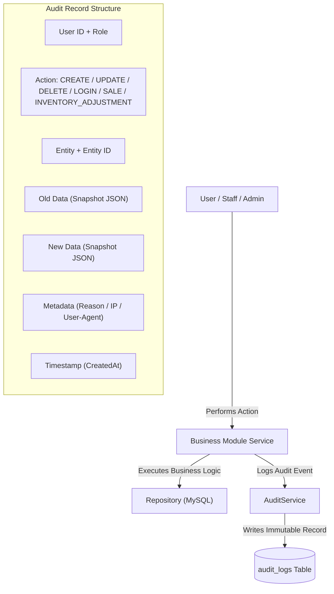

# 🔐 PHARMACY POS — PHASE 10
# Audit, Security & System Administration Architecture

## 1. Executive Business Purpose

The **Audit, Security & System Administration Layer** provides an enterprise-grade monitoring, accountability, and configuration engine for the Pharmacy POS platform:
- **Full Operational Traceability (Audit Logs):** Records *Who*, *What*, *When*, *Where*, old values, new values, and business reasons for all sensitive actions (e.g. price updates, inventory adjustments, refunds, payroll settlements).
- **Authentication & Security Events:** Monitors login attempts (`LOGIN_SUCCESS`, `LOGIN_FAILED`), calculates failure rates, and tracks suspicious authentication activity.
- **Dynamic System & Business Settings:** Centralizes configuration parameters (pharmacy info, tax rates, loyalty conversion ratios, low stock warning thresholds, expiry alert horizons) to eliminate hard-coded constants.

---

## 2. Audit Logging Model & Activity Tracking



### Traceability Example: Price / Inventory Adjustments
When a manager adjusts product pricing or batch quantities:
```json
{
  "action": "INVENTORY_ADJUSTMENT",
  "entity": "batches",
  "entityId": "BATCH-AUG-01",
  "oldData": { "quantity": 100 },
  "newData": { "quantity": 70 },
  "metadata": { "reason": "Damaged during unloading", "ip": "192.168.1.15" }
}
```

---

## 3. Dynamic System & Business Settings

| Setting Key | Default Value | Visibility | Purpose |
|---|---|---|---|
| `pharmacy_name` | `"Al-Amal Modern Pharmacy"` | Public | Official Pharmacy Name for UI & Invoices |
| `pharmacy_phone` | `"+201000000000"` | Public | Hotline & WhatsApp Customer Contact |
| `pharmacy_address` | `"Cairo, Egypt"` | Public | Physical Address on Receipts |
| `currency` | `"EGP"` | Public | Standard Currency Symbol |
| `tax_rate` | `"0.00"` | Public | Default Sales Tax Rate (%) |
| `invoice_prefix` | `"INV"` | Public | Invoice Number Prefix |
| `low_stock_threshold` | `"10"` | Private | Alert Horizon for Low Stock Detection |
| `expiry_alert_days` | `"90"` | Private | Alert Horizon for Expiring Batches (Days) |
| `loyalty_points_per_egp` | `"0.1"` | Private | Loyalty Points Earned per 1 EGP Spent |
| `loyalty_point_value` | `"0.1"` | Private | Redemption Value of 1 Loyalty Point (EGP) |
| `commission_default_rate`| `"5.0"` | Private | Default Staff Commission Percentage (%) |

---

## 4. API Endpoints & RBAC Matrix

### Audit Logs (`/api/v1/audit-logs`)
| Endpoint | Method | Allowed Staff Roles | Purpose |
|---|---|---|---|
| `/api/v1/audit-logs` | `GET` | `PLATFORM_MANAGER`, `PHARMACY_MANAGER` | Query paginated audit log entries with filters |
| `/api/v1/audit-logs/summary` | `GET` | `PLATFORM_MANAGER`, `PHARMACY_MANAGER` | Activity summary & action type breakdown |
| `/api/v1/audit-logs/:id` | `GET` | `PLATFORM_MANAGER`, `PHARMACY_MANAGER` | Get detailed audit record with diff snapshots |

### Security & Authentication Logs (`/api/v1/security`)
| Endpoint | Method | Allowed Staff Roles | Purpose |
|---|---|---|---|
| `/api/v1/security/logs` | `GET` | `PLATFORM_MANAGER`, `PHARMACY_MANAGER` | Query authentication logs (success/failed attempts) |
| `/api/v1/security/stats` | `GET` | `PLATFORM_MANAGER`, `PHARMACY_MANAGER` | Login attempt counts and failure rate statistics |

### System Settings (`/api/v1/settings`)
| Endpoint | Method | Allowed Staff Roles | Purpose |
|---|---|---|---|
| `/api/v1/settings/public` | `GET` | Public / All | Get public receipt and UI branding configurations |
| `/api/v1/settings` | `GET` | `PLATFORM_MANAGER`, `PHARMACY_MANAGER`, `ACCOUNTANT` | Get all system and business settings |
| `/api/v1/settings` | `PATCH` | `PLATFORM_MANAGER`, `PHARMACY_MANAGER` | Batch update settings (audited) |
| `/api/v1/settings/:key` | `GET` | `PLATFORM_MANAGER`, `PHARMACY_MANAGER`, `ACCOUNTANT` | Get specific setting value |
| `/api/v1/settings/:key` | `PATCH` | `PLATFORM_MANAGER`, `PHARMACY_MANAGER` | Update single setting value (audited) |
