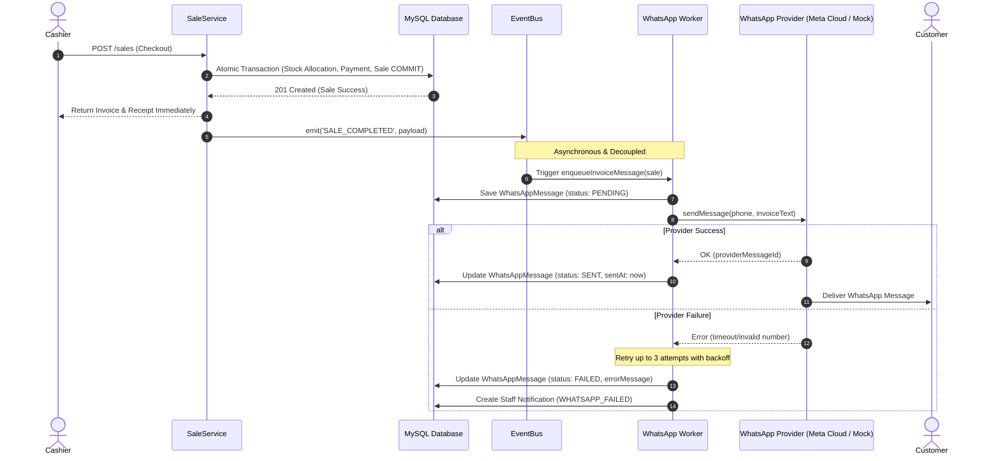

# 📲 PHARMACY POS — PHASE 10
# Notifications & WhatsApp Customer Communication Module

## 1. Executive Business Purpose

The **Phase 10 Communication Layer** provides two decoupled communication systems:
1. **WhatsApp Customer Transactional Messaging:** Asynchronously sends customers their purchase invoices and receipts upon sale completion without ever blocking, slowing down, or risking the database integrity of the POS checkout transaction.
2. **Internal System Notifications:** Generates persistent, real-time alerts for staff users regarding operational events (e.g. `LOW_STOCK`, `EXPIRY_ALERT`, `SALE_COMPLETED`, and `SYSTEM_ALERT` on communication failures).

---

## 2. Decoupled Event-Driven Flow (Sale $\to$ WhatsApp)



### Critical Resilience Guarantees:
- **Zero Checkout Block:** The POS sale transaction commits **before** any communication logic executes.
- **Fault-Tolerant:** If the WhatsApp API or network fails, the sale remains **100% SUCCESSFUL**.
- **No Phone Handling:** Walk-in customers without a recorded phone number succeed seamlessly without attempting WhatsApp dispatch.
- **Idempotency:** Re-processing a sale checks for existing `PENDING` or `SENT` messages to prevent duplicate invoice spamming.

---

## 3. API Endpoints & RBAC Matrix

### System Notifications (`/api/v1/notifications`)
| Endpoint | Method | Allowed Staff Roles | Purpose |
|---|---|---|---|
| `/api/v1/notifications` | `GET` | All Authenticated Staff | Query current user's notifications (supports pagination, unread filter, type filter) |
| `/api/v1/notifications/unread-count` | `GET` | All Authenticated Staff | Get total count of unread notifications |
| `/api/v1/notifications/:id/read` | `PATCH` | All Authenticated Staff | Mark a specific notification as read |
| `/api/v1/notifications/read-all` | `PATCH` | All Authenticated Staff | Mark all notifications as read for current user |

### WhatsApp Management (`/api/v1/whatsapp`)
| Endpoint | Method | Allowed Staff Roles | Purpose |
|---|---|---|---|
| `/api/v1/whatsapp/messages` | `GET` | `PLATFORM_MANAGER`, `PHARMACY_MANAGER`, `ACCOUNTANT`, `PHARMACIST` | Query WhatsApp communication history with filters (phone, sale, status, date range) |
| `/api/v1/whatsapp/messages/:id` | `GET` | `PLATFORM_MANAGER`, `PHARMACY_MANAGER`, `ACCOUNTANT`, `PHARMACIST` | View detailed WhatsApp message information |
| `/api/v1/whatsapp/messages/:id/retry` | `POST` | `PLATFORM_MANAGER`, `PHARMACY_MANAGER` | Manually re-queue a permanently `FAILED` message |

---

## 4. Provider Abstraction

The business layer communicates with an abstract `IWhatsAppProvider`:
```ts
export interface IWhatsAppProvider {
  sendMessage(phone: string, message: string): Promise<WhatsAppSendResult>;
}
```
- **Default:** `MockWhatsAppProvider` for local development, CI/CD, and offline sandbox testing.
- **Production-Ready:** Drop-in support for Meta WhatsApp Cloud API or Twilio WhatsApp API without touching the `WhatsAppService` or POS modules.

---

## 5. Retry Policy & Failure Notification

1. When a message is processed, it is attempted up to **3 times**.
2. If all 3 attempts fail:
   - Status transitions to `FAILED` with detailed `errorMessage`.
   - Generates an internal `SYSTEM_ALERT` notification for managers (`PLATFORM_MANAGER`, `PHARMACY_MANAGER`).
   - Managers can review failure logs in `/whatsapp/messages` and click **Retry** via `POST /whatsapp/messages/:id/retry`.

---

## 6. Audit Logging

All communication actions write structured audit events:
- `WHATSAPP_CREATED` / `CREATE`: Initial message creation
- `WHATSAPP_SENT` / `CREATE`: Successful provider dispatch
- `WHATSAPP_FAILED` / `UPDATE`: Final failure state transition
- `MANUAL_RETRY` / `UPDATE`: Manager manual retry invocation
