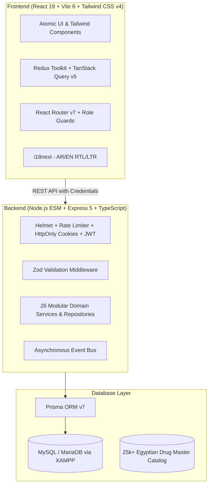

Listed directory -PHARMACY-POS
Viewed package.json:1-24
Viewed README.md:1-156
Listed directory pharmacy-pos-backend
Listed directory pharmacy-pos-frontend
Viewed package.json:1-66
Viewed package.json:1-43
Viewed schema.prisma:1-707
Listed directory src
Listed directory src
Listed directory modules
Listed directory pages
Listed directory features
Listed directory routes
Listed directory scripts
Listed directory egyptian-drug-database
Listed directory backups
Listed directory scripts
Viewed app.ts:1-59
Viewed server.ts:1-45
Listed directory components
Listed directory locales
Listed directory sales
Listed directory inventory
Viewed index.ts:1-108
Listed directory middlewares
Listed directory sales
Viewed sales.service.ts:1-317
Viewed sales.repository.ts:1-100
Viewed sales.repository.ts:180-260
Listed directory store
Listed directory slices
Listed directory layout
Listed directory ui
Viewed AppRoutes.tsx:1-150
Viewed POSPage.tsx:1-146
Viewed permissions.ts:1-51
Viewed env.ts:1-75

إليك **التحليل الفني الشامل والعميق** لمشروع **نظام إدارة الصيدليات ونقاط البيع (Al-Amal Pharmacy POS & Management System)**:

---

# 🏥 تقرير التحليل الشامل للمشروع (Comprehensive Architecture & Code Analysis)

## 📌 1. نظرة عامة على المشروع (Executive Summary)

المشروع عبارة عن **نظام متكامل، احترافي، وجاهز للإنتاج (Production-Ready Full Stack POS & ERP)** مخصص لإدارة الصيدليات وسلاسل التوزيع ومنافذ البيع الدوائي، مع التركيز على السوق المصري والعربي.

تم بناء النظام بهندسة برمجية حديثة وقوية تعتمد على **المعمارية المعيارية القائمة على الميزات (Modular Feature-Sliced Architecture)**، مع دعم كامل للغة العربية والإنجليزية، وتوافق تام مع الباركود، الفواتير الحرارية، الصرف الذكي حسب تاريخ الصلاحية (**FEFO**)، وقاعدة بيانات الأدوية المصرية الكاملة (أكثر من **25,000 صنف**).

---

## 🏗️ 2. المعمارية الفنية ومجموعة التقنيات (Tech Stack & Architecture)

### 💻 تقنيات الواجهة الأمامية (Frontend):
* **إطار العمل:** [React 19](file:///d:/-PHARMACY-POS/pharmacy-pos-frontend/package.json) مع [TypeScript](file:///d:/-PHARMACY-POS/pharmacy-pos-frontend/tsconfig.json).
* **أداة البناء:** Vite 6 مع تحسين تقسيم الحزم (Code Chunking).
* **إدارة الحالة (State Management):** نموذج هجين احترافي يجمع بين:
  * **Redux Toolkit:** لإدارة حالة الجلسة (Auth)، سلة المشتريات (POS Cart)، تفضيلات الواجهة (UI/Theme/Language).
  * **TanStack React Query v5:** لإدارة الـ Server State والتخزين المؤقت (Caching) والتحديث التلقائي للبيانات.
* **التوجيه والصلاحيات:** React Router v7 مع مكونات حماية المسارات [`ProtectedRoute`](file:///d:/-PHARMACY-POS/pharmacy-pos-frontend/src/components/common/ProtectedRoute.tsx) و [`RoleGuard`](file:///d:/-PHARMACY-POS/pharmacy-pos-frontend/src/components/common/RoleGuard.tsx).
* **التصميم والواجهات:** Tailwind CSS v4 مع دعم كامل للاتجاهين (RTL/LTR) وأيقونات Lucide React.
* **الرسوم البيانية:** Recharts لتقارير ولوحات التحكم المالية الذكية.

### ⚙️ تقنيات الواجهة الخلفية (Backend):
* **بيئة التشغيل:** Node.js (ES Modules) مع TypeScript عبر `tsx`.
* **الخادم والأمان:** Express v5 مع [Helmet](file:///d:/-PHARMACY-POS/pharmacy-pos-backend/src/app.ts), CORS مع أمان الـ Credentials, وتحديد معدل الطلبات (Rate Limiting).
* **قواعد البيانات و ORM:** [Prisma ORM v7.9](file:///d:/-PHARMACY-POS/pharmacy-pos-backend/prisma/schema.prisma) متصل بـ MySQL / MariaDB (XAMPP).
* **المصادقة والأمان:** JWT مُخزن داخل **HttpOnly Cookie** مع تشفير كلمات المرور باستخدام `bcrypt` (10 Salt Rounds).
* **التحقق من البيانات (Validation):** تشفير وتحقق كامل لجميع المدخلات عبر مكتبة [Zod](file:///d:/-PHARMACY-POS/pharmacy-pos-backend/src/middlewares/validate.middleware.ts).

---

## 🗄️ 3. تحليل قاعدة البيانات وهيكلة النماذج (Database Schema Analysis)

يحتوي ملف [`schema.prisma`](file:///d:/-PHARMACY-POS/pharmacy-pos-backend/prisma/schema.prisma) على تصميم متماسك ومفهرس بدقة يغطي **16+ نموذجاً رئيسياً**:

| النموذج (Model) | الوظيفة ودورها في النظام | العلاقات والميزات |
|---|---|---|
| [`Product`](file:///d:/-PHARMACY-POS/pharmacy-pos-backend/prisma/schema.prisma#L117) | الأصناف والأدوية الأساسية | الفئة، السعر الجبري وسعر الشراء، الباركود، حد الطلب الأدنى. |
| [`Batch`](file:///d:/-PHARMACY-POS/pharmacy-pos-backend/prisma/schema.prisma#L146) | التشغيلات وتواريخ الصلاحية | تتبع الكمية وتاريخ الصلاحية ورقم التشغيلة لتحقيق نظام **FEFO**. |
| [`Sale`](file:///d:/-PHARMACY-POS/pharmacy-pos-backend/prisma/schema.prisma#L259) & [`SaleItem`](file:///d:/-PHARMACY-POS/pharmacy-pos-backend/prisma/schema.prisma#L293) | الفواتير ومبيعات الكاشير | العمليات الذرية، الخصومات، التأمين، العمولات، والمدفوعات. |
| [`InventoryTransaction`](file:///d:/-PHARMACY-POS/pharmacy-pos-backend/prisma/schema.prisma#L235) | دفتر حركة المخزون | تسجيل القيد المزدوج لكل وارد ومنصرف ومرتجع وتعديل جرد. |
| [`Customer`](file:///d:/-PHARMACY-POS/pharmacy-pos-backend/prisma/schema.prisma#L47) & [`CustomerTier`](file:///d:/-PHARMACY-POS/pharmacy-pos-backend/prisma/schema.prisma#L33) | بيانات العملاء ومستوياتهم | إدارة الخصومات التلقائية والملف الدوائي للعميل. |
| [`LoyaltyAccount`](file:///d:/-PHARMACY-POS/pharmacy-pos-backend/prisma/schema.prisma#L73) | برنامج نقاط الولاء | احتساب النقاط واستبدالها برصيد نقدي في الفواتير. |
| [`InsuranceProvider`](file:///d:/-PHARMACY-POS/pharmacy-pos-backend/prisma/schema.prisma#L351) & [`CustomerInsurance`](file:///d:/-PHARMACY-POS/pharmacy-pos-backend/prisma/schema.prisma#L368) | التأمين الصحي والمطالبات | تحديد نسبة التحمل ونسبة التغطية ورقم البوليصة والمطالبة. |
| [`Purchase`](file:///d:/-PHARMACY-POS/pharmacy-pos-backend/prisma/schema.prisma#L187) & [`Supplier`](file:///d:/-PHARMACY-POS/pharmacy-pos-backend/prisma/schema.prisma#L169) | المشتريات والموردين | تسجيل الفواتير وتوليد التشغيلات وضبط الحسابات آلياً. |
| [`SaleReturn`](file:///d:/-PHARMACY-POS/pharmacy-pos-backend/prisma/schema.prisma#L407) | المرتجعات وإشعارات الدائن | إعادة الأصناف للتشغيلات الأصلية وعكس الحساب المالي. |
| [`Expense`](file:///d:/-PHARMACY-POS/pharmacy-pos-backend/prisma/schema.prisma#L451), [`Payroll`](file:///d:/-PHARMACY-POS/pharmacy-pos-backend/prisma/schema.prisma#L503), [`CommissionTransaction`](file:///d:/-PHARMACY-POS/pharmacy-pos-backend/prisma/schema.prisma#L483) | الإدارة المالية والأجور | تتبع المصروفات التشغيلية، عمولات البيع، ومسيرات الرواتب. |
| [`AuditLog`](file:///d:/-PHARMACY-POS/pharmacy-pos-backend/prisma/schema.prisma#L563) | سجل الرقابة والتدقيق الأمني | تسجيل كل العمليات الحساسة مع تفاصيل البيانات السابقة والجديدة. |

---

## 🎯 4. تحليل الوظائف والموديولات البرمجية (Core Modules Breakdown)

### 1️⃣ شاشة نقطة البيع والكاشير السريعة ([`POSPage.tsx`](file:///d:/-PHARMACY-POS/pharmacy-pos-frontend/src/pages/POSPage.tsx)):
- **سرعة فائقة:** اختصارات لوحة المفاتيح المباشرة (`F1` للبحث، `F2` لمسح الباركود، `F8` للدفع الفوري، `Esc` للإلغاء).
- **الصرف الذكي (FEFO):** النظام يقوم آلياً بفرز وتخصيص الدواء من التشغيلة الأقرب لانتهاء الصلاحية عبر [`batchesService.getFEFOBatches`](file:///d:/-PHARMACY-POS/pharmacy-pos-backend/src/modules/sales/sales.service.ts#L133).
- **المدفوعات المتعددة (Split Payments):** إمكانية تقسيم الفاتورة الواحدة بين (كاش + فيزا + محفظة إلكترونية).
- **الطباعة المتعددة:** دعم الطباعة المباشرة للإيصالات الحرارية (80mm Thermal Receipts) وفواتير المقاس القياسي (A4 Invoices).

### 2️⃣ العمليات المالية والمعاملات الذرية ([`sales.repository.ts`](file:///d:/-PHARMACY-POS/pharmacy-pos-backend/src/modules/sales/sales.repository.ts#L183)):
- تتم عملية الدفع بالكامل داخل `prisma.$transaction` الذرية، مما يضمن استحالة حدوث تضارب في المخزون (Race Conditions) باستخدام جمل التحقق `quantity: { gte: item.quantity }`.
- تحديث متزامن لـ: رصيد المخزون، سجل حركة المخزون، سجل الفاتورة، تفاصيل الأصناف، المدفوعات، نقاط الولاء، عمولة الصيدلي، وسجل التدقيق.

### 3️⃣ إدارة الصلاحيات والأدوار (RBAC - Role-Based Access Control):
النظام يدعم 4 أدوار وظيفية محددة بدقة في [`permissions.ts`](file:///d:/-PHARMACY-POS/pharmacy-pos-frontend/src/config/permissions.ts):
1. **`PLATFORM_MANAGER` (مدير المنظومة):** صلاحيات غير مقيدة لإدارة كافة الإعدادات والمستخدمين والتقارير.
2. **`PHARMACY_MANAGER` (مدير الفرع / صيدلي أول):** إدارة العمليات اليومية والمشتريات والمخازن والتقارير.
3. **`PHARMACIST` (صيدلي / كاشير):** واجهة مخصصة تركز على الـ POS، العملاء، الجرد السريع، والمرتجعات.
4. **`ACCOUNTANT` (محاسب مالي):** وصول كامل للوحات التحكم المالية، المصروفات، الرواتب، وسجل المدفوعات.

### 4️⃣ أدوات التشغيل والأتمتة (DevOps & Desktop Scripts):
داخل مجلد [`scripts/`](file:///d:/-PHARMACY-POS/scripts):
- وجود اسكريبتات PowerShell و VBS جاهزة للتشغيل بضغطة زر واحدة بدون الحاجة لفتح الـ Terminal ([`launch.ps1`](file:///d:/-PHARMACY-POS/scripts/launch.ps1) و [`create-desktop-shortcuts.ps1`](file:///d:/-PHARMACY-POS/scripts/create-desktop-shortcuts.ps1)).
- اسكريبتات النسخ الاحتياطي التلقائي لقاعدة البيانات واستعادتها ([`backup-database.ts`](file:///d:/-PHARMACY-POS/pharmacy-pos-backend/scripts/backup-database.ts)).

---

## 💎 5. نقاط القوة الهندسية في المشروع (Key Architectural Strengths)

1. **فصل المسؤوليات (Clean Architecture):** كل موديول في الـ Backend منظم داخل (Controller, Service, Repository, Validator, Routes, Types).
2. **الواجهة الأمامية ذات الأداء العالي:** استخدام React 19 مع مجمّع Vite 6 واستخدام مكتبات Tailwind v4 يمنح سرعة تحميل استثنائية وزمن استجابة فوري.
3. **أمان عالي (Security Best Practices):** الاعتماد على `HttpOnly` Cookies لمنع ثغرات XSS، وتطبيق Rate Limiter ضد هجمات الـ Brute-Force، وتحقق شامل من المدخلات عبر Zod.
4. **شبه انعدام للبيانات الزائفة (Zero-Fabrication Catalog):** توفر قاعدة بيانات متكاملة تحتوي على 25,000+ صنف مسجلة رسمياً بالأسعار والباركود.
5. **تغطية شاملة للاختبارات:** وجود 10 اسكريبتات فحص واختبار تكاملية (Integration Tests) تغطي جميع مراحل المشروع من المرحلة 2 وحتى المرحلة 10.

---

## 🚀 6. التوصيات ومسارات التطوير المستقبلية (Recommendations for Next Level)

| المجال | التوصية الفنية | الفائدة المضافة |
|---|---|---|
| **الربط اللحظي (Real-time)** | إضافة **WebSockets (Socket.io)** بين الكواشير | مزامنة فورية لتحديث أرصدة المخزون والتنبيهات الحية عبر عدة أجهزة في الصيدلية. |
| **العمل بدون إنترنت (Offline POS)** | دعم **PWA & IndexedDB Local Storage** | تمكين الكاشير من استمرار البيع والطباعة في حال انقطاع الشبكة والمزامنة التلقائية عند عودتها. |
| **النسخ السحابي (Cloud Backups)** | ربط اسكريبت النسخ الاحتياطي بخدمة سحابية (S3 / Google Drive) | حماية إضافية للبيانات من التلف الفيزيائي للأجهزة المحلية. |
| **بوابة رسائل الواتساب (WhatsApp Gateway)** | ربط واجهة الواتساب الحالية بمزود حقيقي مثل Meta Cloud API أو UltraMsg | إرسال الفواتير الإلكترونية وإشعارات جاهزية الطلبيات للعملاء تلقائياً. |

---

## 🏁 الخلاصة

المشروع مبني باحترافية عالية جداً، ويتبع أفضل الممارسات البرمجية المعاصرة (**Industry Standards**)، ويشكل منصة ERP & POS متكاملة وقابلة للتوسع التجاري والإنتاجي مباشرة.